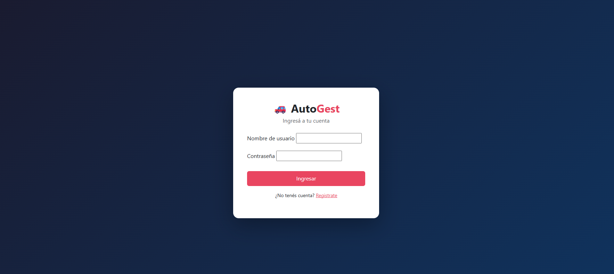
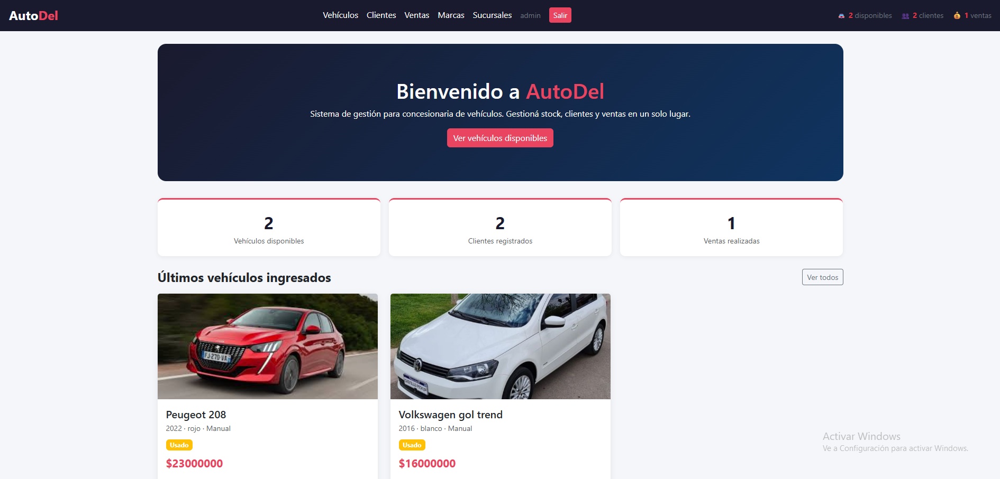
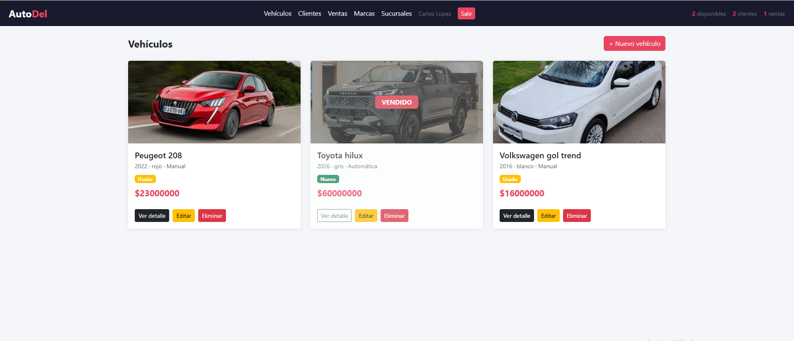
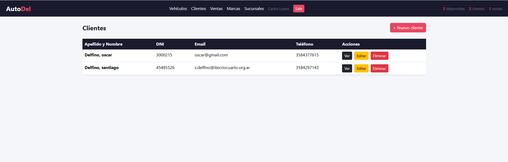
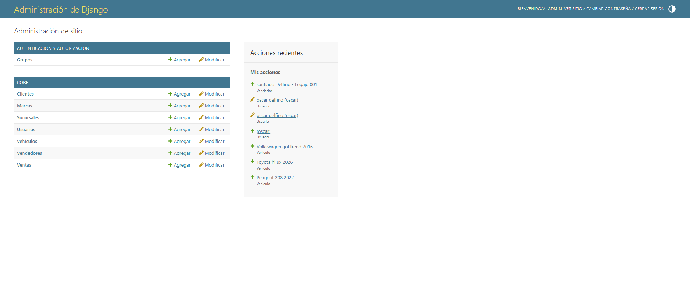

# AutoDel - Sistema de gestión para concesionaria

TP evaluativo de Ingeniería de Software - 2026

---

## De qué se trata

Hice un sistema web para gestionar una concesionaria de autos. Desde acá podés cargar vehículos, registrar clientes, hacer ventas y manejar todo lo que tiene que ver con el negocio. Lo desarrollé con Django y una base de datos SQLite.

---

## Modelos que usamos

- **Usuario** - usuario personalizado con AbstractUser, tiene campos extra como teléfono y DNI
- **Marca** - marcas de autos, tiene logo con ImageField
- **Sucursal** - las distintas sedes de la concesionaria
- **Vendedor** - está asociado a un usuario y a una sucursal
- **Vehiculo** - el modelo principal, tiene imagen, precio, condición, kilometraje, etc
- **Cliente** - datos de los compradores
- **Venta** - relaciona un vehículo con un cliente y un vendedor, y al guardarse marca el vehículo como no disponible automáticamente

---

## Funcionalidades

- Registro, login y logout desde los templates
- CRUD completo de vehículos y clientes
- Listado de marcas, sucursales y ventas
- Panel de admin con filtros y búsqueda en todos los modelos
- Context processor que muestra en el navbar cuántos vehículos disponibles hay, cuántos clientes y cuántas ventas
- Carga de imágenes funcional para vehículos y logos de marcas
- Sistema de permisos con dos grupos: **Gerente** (puede hacer todo) y **Vendedor** (puede ver vehículos, gestionar clientes y registrar ventas)

---

## Capturas

### Login


### Inicio


### Vehículos (con estado vendido)


### Clientes


### Panel de administración


---

## Cómo correrlo

Necesitás tener Python 3.x instalado.

```bash
# Clonar el repo
git clone https://github.com/Dsan04/concesionaria.git
cd concesionaria

# Instalar dependencias
pip install -r requirements.txt

# Aplicar migraciones
python manage.py migrate

# Cargar grupos y superusuario
python setup_inicial.py

# Iniciar el servidor
python manage.py runserver
```

Después entrás a `http://127.0.0.1:8000`

Usuario admin: `admin` / Contraseña: `admin1234`

Para el panel de administración: `http://127.0.0.1:8000/admin`

---

## Tecnologías

- Python 3.12
- Django 6.0
- SQLite
- Pillow (para las imágenes)
- Bootstrap 5 (CDN)
